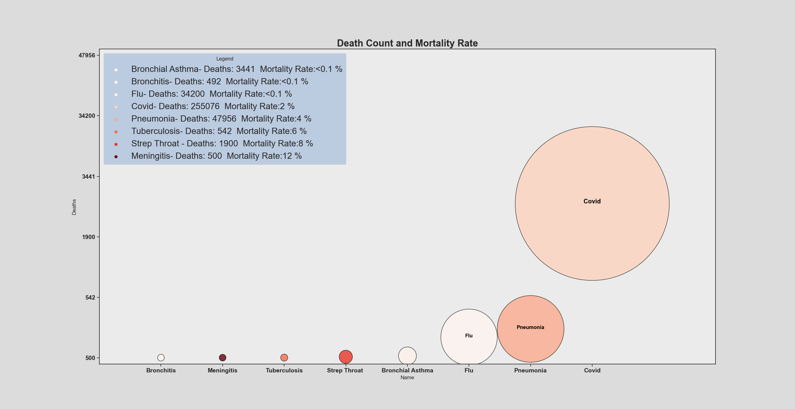
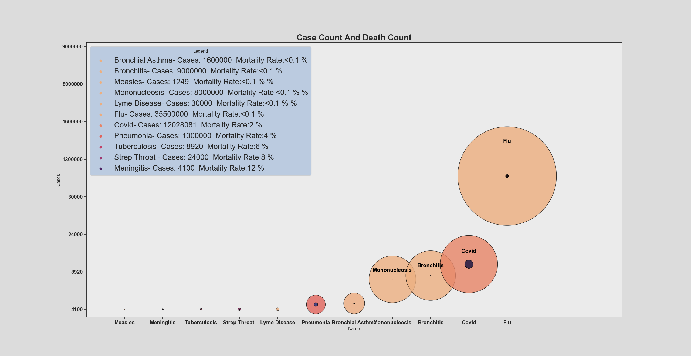
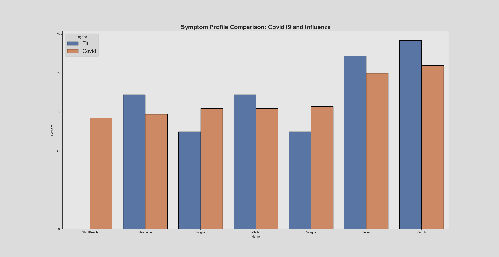
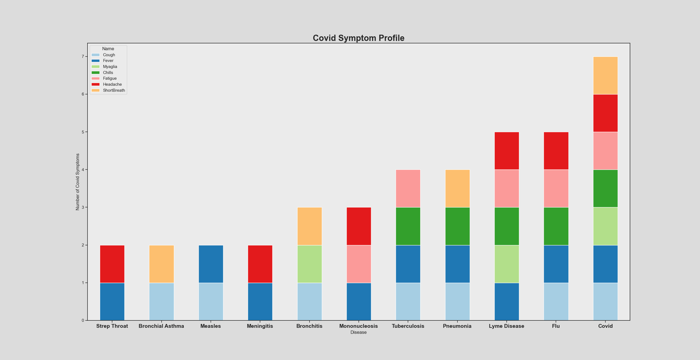

# [BACK](../DataVisualization.md)

# Original Goal
To investigate Covid 19 and examine how the presence or lack of presence of symtpons and various symptom combinations alter the likelihood of the diagnosis being Covid compared to other diseases sharing Covid symptoms.

# End Result
Project became more a showing of how lmited our medical data is for such fine detail statistical level breakdowns of diseases. Has been no real need for such a breakdown before Covid 19 so it simply never occured, previously diagnosis all relied on a doctors best guess based on symptom profile not any kind of probability likliehood, this while having been sufficient before now will become a hindrance as machine learning starts becoming integrated into medical practices at an increasing rate and such systems will require a far greater amount of data than we have ever had before.

However while we couldnt ultimately conduct the symptom analysis as we had hoped for we were still able to show some interesting data comparisons for the diseases as a whole and even some less statistical symptom comparisons relying just on the presence or absence of symptoms in a disease rather than percintile breakdowns of how many diagnosed with that disease actually had that symptom.

# Death Count and Mortality Rate
 

In this visualization, the height of each condition and size reflects the number of deaths (with higher position in the Y axis representing a higher death count) and the area covered by each condition scaled to the death count to give easy relative comparison between conditions with numerical values included in the legend for reference. Lastly, the darkness of the red hue of  each condition represents an increasing mortality rate going lightest to darkest being the most deadly. 

# Case Count vs Death Count
 

In this visualization, each condition’s number of cases is represented by the size of the sphere, with the outer sphere being case count and color hue corresponding to mortality rate, while the inner sphere corresponds to death count giving a good visualization of the proportion rather than a pure numerical percent. 

# Covid vs Influenza Symptom Comparison
 

In this visualization, we compared symptom sensitivity between COVID19 and influenza to analyze and compare the percentage of positively tested patients that have certain symptoms.

# Covid Symptom Presence In Other Major Dieseases Comparison
 

In this visualization, we compare COVID symptom profiles with other major medical conditions based merely on the presence or absence of certain symptoms found in COVID19. The rightmost bar displays COVID19 and it's symptoms and all the colored bars for each individual symptom (headache, fever,etc). This provides a good visualization of the degree of similarity between COVID and the other diseases we our project compared it to. 

# Summary of Primary Findings and Current Limitations of This Project Design
### (For more detailed analysis see full report)
1:Covid only mass scaled lab tested disease in modern history limiting accuracy of non-covid disease diagnosis and data 
2:Lack of symptomatic percentile breakdown atleast on publicly available data: likely partially due to lack of lab testing to confirm diagnosis and thus reluctance to publish data 
3:Even when percentile symptomatic breakdown exists almost never includes multi symptom percentile that would be required to compare symptom combinations 
4:Lack of truly comparable disease, no regularly occurring disease aside from influenza comes close to covid in case scale/death count 
5:Previous epidemics either of minimal scale eg ebola/zika virus or before modern documentation practices to truly compare to eg spanish flu 
6:Ongoing epidemic and thus the data will always include a factor of unknown amount of incompleteness 

# Link To Full Project Report
[Project Report](Data%20Vis%20Final%20Project%20Report.pdf) 
# Download Code and Data files
[Code and Data Files](CovidSympt.zip) 
