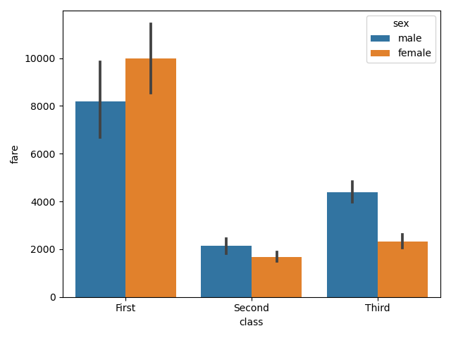
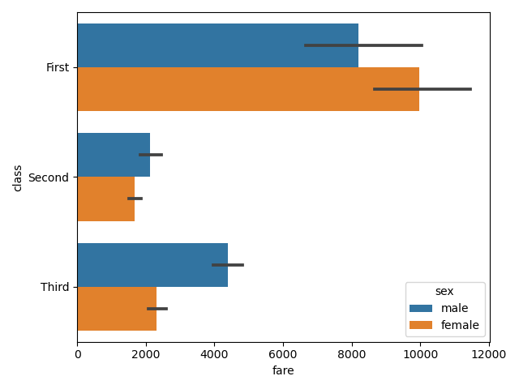
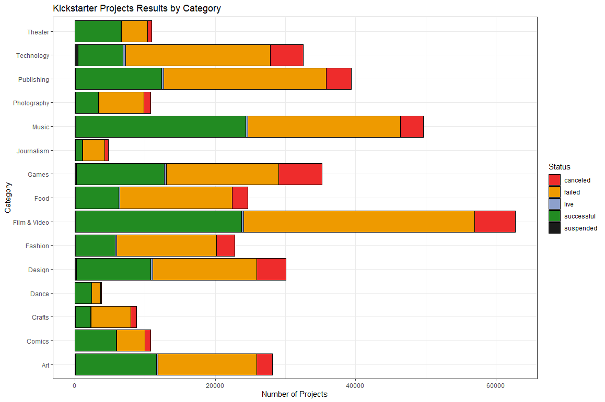
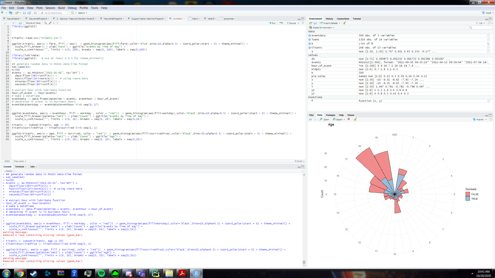
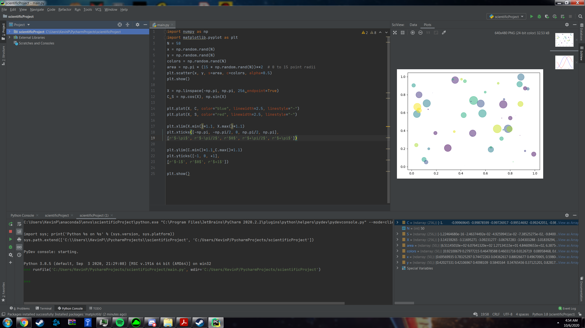

# Covid Final Project
[Covid Final Project](./CovidProject/CovidProject)

# Covid project tests
[Covid 3D Idea Tests](3dtest.mp4)

# Original Covid Idea
[Covid original Idea Drawing](datavisdemo.png)

# Chart Examples and Assignments
```python
import matplotlib.pyplot as plt
import seaborn as sns
import pandas as pd


df = sns.load_dataset("titanic")
df = pd.DataFrame(df)

fig1 = sns.barplot(x=df['class'],y=df['fare'],hue=df['sex'],estimator=sum)
plt.show()

fig2 = sns.barplot(x=df['fare'],y=df['class'],hue=df['sex'],estimator=sum,orient="h")
plt.show()
```

<br/>
[Code File](main.py)<br/>

<br/>
```python

library(ggplot2)
library(RColorBrewer)

# Load data
kickstarterdata = read.csv("C:\\Users\\Kevin\\Downloads\\ks.csv")
# Data exploration
summary(kickstarterdata)
head(kickstarterdata)
min(kickstarterdata$launched) # todo: remove 1970 "null" values
# Remove undefined/impossible values
# Remove 1970 attributes, as well as those with undefined state.
kickstarterdata2<-kickstarterdata[!(kickstarterdata$launched == "1970-01-01 01:00:00" | kickstarterdata$state == "undefined"),]
min(kickstarterdata2$launched)

brewer.pal(12, "Set2")
display.brewer.pal(12, "Set2")
colors <- c("canceled" = "firebrick2", "failed" = "orange2", "live" = "#8DA0CB", "successful" = "forestgreen", "suspended" = "gray10")


d <- ggplot(data = kickstarterdata2, 
            mapping = aes(main_category))
d + geom_bar(aes(fill = state), colour = "black") + theme_bw() + coord_flip()+
  scale_fill_manual(values = colors) + 
  labs(title = "Kickstarter Projects Results by Category",
       x = "Category",
       y = "Number of Projects") + guides(fill=guide_legend(title="Status"))
```
# Interesting Chart Ideas and Tests

<br/>

# Overfitting
[ OverFitting](Overfitting.docx)
# Video Review Assignment
[Video Review](Jurnalism%20in%20the%20Age%20of%20Data%20Review.pdf)
