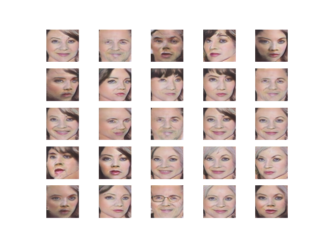
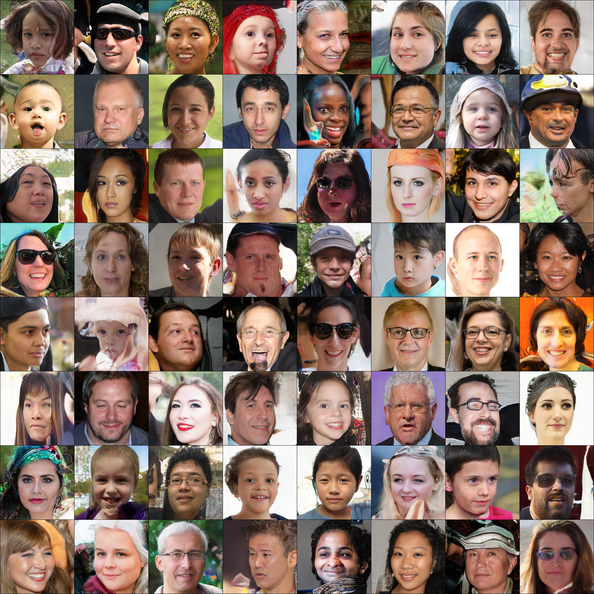

# Gans-WIP
My current focus of interest is in Gans and image synthesis, I've only recently upgraded my hardware to be able to run higher resolution tests so this page is under construction right now but here are some previews of my previous vs new tests.

Some of my earliest tests on small resolution data sets, they were poorly written and quickly broke down into mode collapse

More recent 512x512 resolution with a fid of ~24 in about 16 hours of training

# Interesting Links for Gan Study
### Original Nvidia StyleGan, Current State of the art
[StyleGan2](https://github.com/NVlabs/stylegan2) 
[StyleGan2-Improved](https://github.com/NVlabs/stylegan2-ada)
### Lightweight Pytorch Gan modified version was used for above images, faster and lower hadware requirements but lower than STOA quality
[PytorchGan](https://github.com/lucidrains/lightweight-gan)
